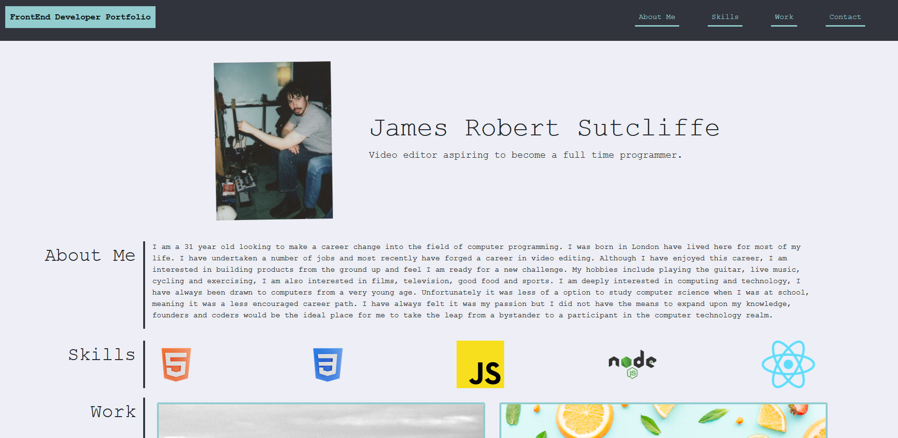

## Frontend Portfolio

## Description

I created this Bootstrap portfolio to have a well designed, mobile friendly for me to display my developer projects, contact details and information about myself. In undertaking this task I was also motivated to improve my implementation of front-end design, specifically utilising bootstrap 4.3. Undertaking this project has allowed me to build an efficent and usable resource for me to send to prospectiive employers or whomever I would like to share my achievements in programming with, as well as linking them to my githib, linkedin and email. Completing this project allowed me to further develop my front-end design skills with HTML, CSS and boostrap whilst also allowing me to focus on a mobile friendly setup. 

## Installation

N/A.

## Usage

The deployed site has an intuitive design with a navigation bar linking to the various sections of the page. There is also clickable links to examples of my work and contact details.

## Features

## Credits

N/A.

## License

please see license file in main branch of gitHub repository.

## Deployed Site

https://jamesrobertsutcliffe.github.io/frontend-portfolio/
